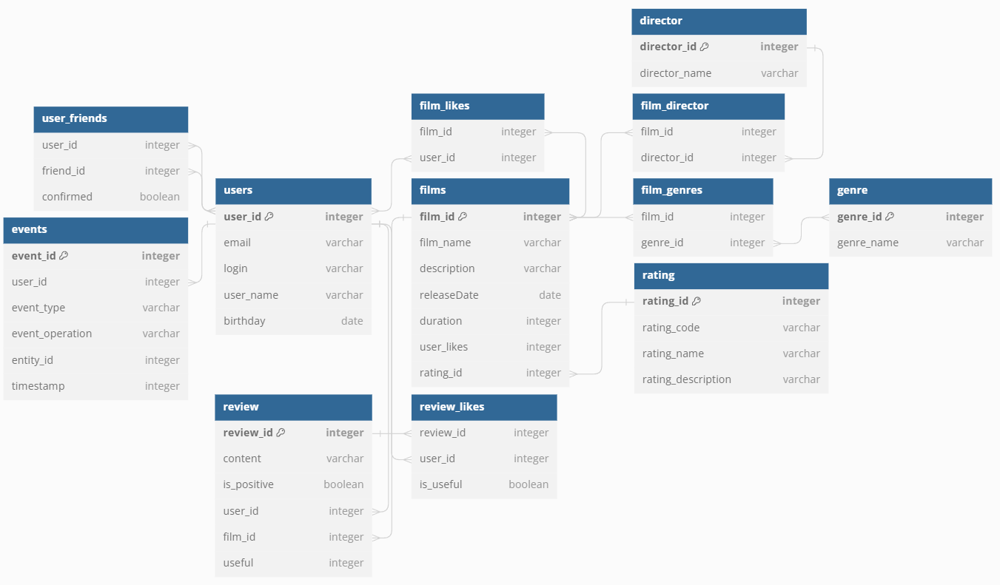

# java-filmorate
## Er диаграмма

## Примеры запросов

### Пользователи

```
INSERT INTO  public.users (user_id, email, login,name)
VALUES
	(1, 'aaaaaa@dd.rrr', 'one', 'first'),
	(2, 'bbbbbb@dd.rrr', 'two', 'second');
```

```
SELECT * 
  FROM public.users
 WHERE user_id = 1;
```
 
```
INSERT INTO public.user_friends(user_id, friend_id, confirmed)
	VALUES (1, 2, false);
```

```
SELECT user_id, friend_id, confirmed
  FROM public.user_friends;
```

### Фильмы

```
SELECT * 
  FROM public.films f
  JOIN public.film_genres fg ON fg.film_id = f.film_id
  JOIN public.genre g        ON f.genre_id = fg.genre_id
  JOIN public.film_likes l   ON l.film_id = f.film_id
  JOIN public.users u        ON u.user_id = l.user_id;
```

